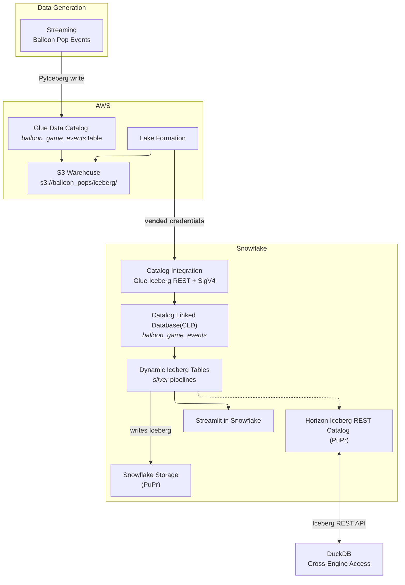

# Lakehouse Transformations: Build Production Pipelines for your Iceberg Tables

Stop pipeline sprawl and the cost of data duplication. This lab shows how to perform secure, in-place transformations across your entire data estate: connect externally managed Iceberg tables with Catalog Linked Databases to always work on fresh data without ETL, build efficient and declarative pipelines with Dynamic Tables for Iceberg preserving multi-engine access to your data, and implement business continuity to ensure your production data is always available.

> The companion Snowflake Quickstart walks through the same steps in a guided format. Link will be added on publish.

## Architecture




### Lab Layers

| Layer | Technology | What it does |
|-------|------------|--------------|
| Bronze | Glue + S3 + PyIceberg | Loads raw game events as Iceberg in AWS |
| Catalog | Snowflake Catalog Integration | Connects Snowflake to Glue Iceberg REST with SigV4 + LF vended credentials |
| CLD | Catalog-Linked Database | Mirrors Glue namespaces and tables as Snowflake schemas — no data copy |
| Silver | Dynamic Iceberg Tables | Transforms JSON bronze into 5 aggregation tables; writes Iceberg back to S3 |
| Dashboard | Streamlit in Snowflake | Live dashboard over silver DTs; zero local server |
| Cross-engine | DuckDB via HIRC | Queries silver Iceberg tables through Snowflake's Horizon REST Catalog |

---

## Prerequisites

### Clone the Repository

```bash
git clone https://github.com/Snowflake-Labs/sfguide-lakehouse-iceberg-production-pipelines.git
cd sfguide-lakehouse-iceberg-production-pipelines
```

### Accounts and Permissions

- AWS account with a named profile (`AWS_PROFILE`) that can create and update Glue databases, manage IAM roles, and access S3
- Snowflake account with `ACCOUNTADMIN` or a role with `CREATE INTEGRATION`, `CREATE DATABASE`, and `CREATE STREAMLIT` privileges
- Snowflake CLI connection configured for that account — `snow connection list` and `snow connection test` both succeed

### Required Tools

This repo targets Python 3.12+. `uv` manages the interpreter and all dependencies.

| Tool | Role | macOS | Linux (Debian/Ubuntu) | Windows |
|------|------|-------|-----------------------|---------|
| **Git** | Clone the repository | `brew install git` | `sudo apt install git` | [Git for Windows](https://git-scm.com/download/win) |
| **uv** | Python deps and `uv run` entrypoints | `brew install uv` | [Astral installer](https://docs.astral.sh/uv/getting-started/installation/) | [PowerShell installer](https://docs.astral.sh/uv/getting-started/installation/) |
| **Task** | `task bronze:*`, `task check-tools` | `brew install go-task` | [Install script](https://taskfile.dev/installation/) | `scoop install task` |
| **AWS CLI v2** | Glue, S3, STS; S3 Tables needs v2.34+ | `brew install awscli` | [AWS bundled installer](https://docs.aws.amazon.com/cli/latest/userguide/getting-started-install.html) | [AWS MSI](https://docs.aws.amazon.com/cli/latest/userguide/getting-started-install.html) |
| **Snowflake CLI** | Snowflake steps; also available via `uv sync` | [Snowflake CLI docs](https://docs.snowflake.com/developer-guide/snowflake-cli/installation/installation) | [Snowflake CLI docs](https://docs.snowflake.com/developer-guide/snowflake-cli/installation/installation) | [Snowflake CLI docs](https://docs.snowflake.com/developer-guide/snowflake-cli/installation/installation) |
| **envsubst** | Renders IAM policy templates (gettext package) | `brew install gettext` | `sudo apt install gettext-base` | WSL2 recommended |
| **jq** | JSON checks at the shell | `brew install jq` | `sudo apt install jq` | `scoop install jq` |

**Windows note:** If `task check-tools` fails only on `envsubst`, use WSL2 or run `uv run bronze-cli render-iam` instead.

### Recommended Tools

| Tool | Why | macOS | Linux | Windows |
|------|-----|-------|-------|---------|
| **direnv** | Auto-loads `.env` when you `cd` into the repo | `brew install direnv` | `sudo apt install direnv` | WSL2 |
| **curl** | Scripts and health checks | pre-installed | pre-installed | [curl.se](https://curl.se/download.html) |
| **openssl** | TLS and crypto one-liners | pre-installed | pre-installed | [OpenSSL binaries](https://wiki.openssl.org/index.php/Binaries) |

### Verify Installation

Sync Python dependencies:

```bash
uv sync
```

Set your AWS profile and run the prerequisite check:

```bash
export AWS_PROFILE=your-profile
task check-tools
```

`task check-tools` runs `tools/check_lab_prereqs.py`: it verifies required binaries on `PATH` and runs `aws sts get-caller-identity`. Fix any missing entries and refresh credentials if STS fails, then re-run until you see **All required tools are available.**

---

## Environment Setup

Copy `.env.example` to `.env` and fill in your values. Never commit `.env`.

```bash
cp .env.example .env
```

Key variables by phase:

| Variable | Phase | Default | Notes |
|----------|-------|---------|-------|
| `AWS_PROFILE` | 1 | required | AWS named profile for all bronze tasks |
| `AWS_REGION` | 1 | required | Keeps all API calls in one region |
| `LAB_USERNAME` | 1 | none | Workshop shared accounts — drives bucket/database name derivation |
| `BRONZE_BUCKET_NAME` | 1 | derived | S3 warehouse bucket; `iceberg/` becomes the Glue warehouse URI |
| `BRONZE_S3TABLES_BUCKET_NAME` | 1 | derived | S3 Tables table bucket (optional, AWS CLI 2.34+) |
| `SNOWFLAKE_DEFAULT_CONNECTION_NAME` | 2 | snow default | Override when using a non-default `snow` connection |
| `SNOWFLAKE_ROLE` | 2 | ACCOUNTADMIN | Role for catalog integration and CLD commands |
| `SNOWFLAKE_ICEBERG_EXTERNAL_VOLUME` | 2 | set after extvol-create | External volume name for silver DTs |
| `SNOWFLAKE_SILVER_DATABASE` | 2 | balloon_silver | Native Snowflake database for DT objects |
| `SNOWFLAKE_SILVER_SCHEMA` | 2 | silver | Schema for silver Dynamic Iceberg Tables |
| `SA_USER` | 5 | duckdb_sa | DuckDB HIRC service account username |
| `SA_ROLE` | 5 | duckdb_silver_reader | DuckDB HIRC service account role |
| `SNOWFLAKE_ACCOUNT_URL` | 5 | required | `https://<org>-<account>.snowflakecomputing.com` |

See [`.env.example`](.env.example) for all variables with inline documentation.

---

## Chapter 1: Bronze Landing Zone

All downstream Snowflake steps assume the bronze Iceberg tables exist in AWS Glue. Complete this chapter before starting Chapter 2.

**Before starting:** confirm `task check-tools` passes and `aws sts get-caller-identity` succeeds.

### Set Up and Load

Render the IAM policy template (optional — run if attaching a new IAM role):

```bash
task bronze:render-iam
```

Create the Glue database and register the S3 warehouse:

```bash
task bronze:glue-setup
```

Provision the S3 Tables control plane (optional — requires AWS CLI 2.34+):

```bash
task bronze:s3tables-setup
```

Load sample balloon game events into the Glue Iceberg table:

```bash
task bronze:load
```

Or run all three setup steps and load in one shot:

```bash
task bronze:all
```

Preview any step without making changes:

```bash
task bronze:glue-setup-dry-run
task bronze:s3tables-setup-dry-run
task bronze:render-iam-dry-run
```

### What Gets Created

| Glue database | Table | Schema |
|---------------|-------|--------|
| **GLUE_DATABASE** (e.g. `ksampath_balloon_pops`) | `balloon_game_events` | `event` — STRING, one JSON object per row |

Each JSON row contains: `player`, `balloon_color`, `score`, `page_id`, `favorite_color_bonus`, `event_ts`. The silver Dynamic Iceberg Tables use `PARSE_JSON` to project these fields into typed columns.

Print a copy-paste sheet of ARNs and exports for Snowflake catalog setup:

```bash
task bronze:snowflake-summary
```

### Lake Formation Setup

After `task bronze:load` and after completing step 1 of Chapter 2 (`task snowflake:create-glue-catalog-read-role`), configure Lake Formation for vended credentials:

```bash
task bronze:lakeformation-setup
```

This step registers the bronze S3 location with Lake Formation, clears default Glue IAM-only table permissions, and grants `SELECT` and `DESCRIBE` to the Snowflake SIGV4 role.

> **Keep the SIGV4 and LF data-access roles separate.** Using the same role causes credential vending errors (error code `094120`).

Preview without AWS writes:

```bash
task bronze:lakeformation-setup-dry-run
```

---

## Chapter 2: Snowflake CLD

This chapter creates the Glue Iceberg REST catalog integration, tightens IAM trust, creates the Catalog-Linked Database, and runs discovery and read queries against `balloon_game_events`.

**Before starting:**

- Bronze tables are loaded; `.aws-config/glue-database.json` was written by `task bronze:glue-setup`
- `snow connection test` succeeds

### Step 1: Create IAM Role

Create the Snowflake SIGV4 IAM role:

```bash
task snowflake:create-glue-catalog-read-role
```

This writes the IAM role ARN to `.aws-config/snowflake-glue-catalog-iam-role-arn.txt`. All subsequent tools read it automatically.

**After this step:** return to Chapter 1 and run `task bronze:lakeformation-setup` before proceeding.

### Step 2: Generate SQL

Generate runnable SQL from your `.aws-config/` artifacts:

```bash
task snowflake:generate-lab-sql
```

This writes two files to `snowflake/lab/generated/`:

- `01_catalog_integration.generated.sql` — CREATE CATALOG INTEGRATION
- `02_cld_verify.generated.sql` — CREATE DATABASE + SHOW + SELECT

Preview without writing files:

```bash
task snowflake:generate-lab-sql-stdout
```

### Step 3: Create Catalog Integration

```bash
snow sql --filename snowflake/lab/generated/01_catalog_integration.generated.sql
```

The generated SQL creates `glue_rest_catalog_int` with `CATALOG_SOURCE = ICEBERG_REST`, `ACCESS_DELEGATION_MODE = VENDED_CREDENTIALS`, and your SIGV4 IAM role.

### Step 4: Describe and Capture Trust Fields

```bash
task snowflake:describe-catalog-integration
```

Note `GLUE_AWS_IAM_USER_ARN` and `GLUE_AWS_EXTERNAL_ID` — needed to tighten the trust policy on the SIGV4 role.

### Step 5: Apply IAM Trust

```bash
task snowflake:render-glue-catalog-trust
task snowflake:apply-glue-catalog-trust-from-rendered
```

This updates the SIGV4 IAM role's trust policy to scope access to Snowflake's specific IAM user ARN and external ID.

### Step 6: Create Catalog-Linked Database

```bash
snow sql --filename snowflake/lab/generated/02_cld_verify.generated.sql
```

This creates `balloon_game_events` as a Catalog-Linked Database and runs initial discovery.

### Verify

```sql
SHOW SCHEMAS IN DATABASE balloon_game_events;
SHOW ICEBERG TABLES IN SCHEMA balloon_game_events."<remote_schema>";

SELECT
  PARSE_JSON(event):player::STRING        AS player,
  PARSE_JSON(event):balloon_color::STRING AS balloon_color,
  PARSE_JSON(event):score::INTEGER        AS score,
  PARSE_JSON(event):event_ts::TIMESTAMP_TZ AS event_ts
FROM balloon_game_events."<remote_schema>"."balloon_game_events"
LIMIT 10;
```

### Full Sequence

```bash
task check-tools
task bronze:snowflake-summary
task snowflake:create-glue-catalog-read-role
# → run: task bronze:lakeformation-setup
task snowflake:generate-lab-sql
snow sql --filename snowflake/lab/generated/01_catalog_integration.generated.sql
task snowflake:describe-catalog-integration
task snowflake:render-glue-catalog-trust
task snowflake:apply-glue-catalog-trust-from-rendered
snow sql --filename snowflake/lab/generated/02_cld_verify.generated.sql
```

---

## Chapter 3: Dynamic Iceberg Tables

With bronze readable through the CLD, build Snowflake-managed Dynamic Iceberg Tables that write silver Iceberg files to storage you control on a declared `TARGET_LAG`. Five aggregation tables refresh automatically and remain readable by any Iceberg-compatible engine.

### Five Silver Tables

| Table | What it aggregates |
|-------|--------------------|
| `dt_player_leaderboard` | Per-player total score, bonus pops, last event |
| `dt_balloon_color_stats` | Per-player, per-color breakdown (pops, points, bonuses) |
| `dt_realtime_scores` | 15-second windowed scores per player |
| `dt_balloon_colored_pops` | 15-second windows by player and balloon color |
| `dt_color_performance_trends` | Average score per pop by color over 15-second windows |

### Step 1: Configure Environment

Set these variables in `.env` before creating the external volume:

| Variable | Default | Notes |
|----------|---------|-------|
| `SILVER_EXTVOLUME_BUCKET_SLUG` | none | Short fragment for sfutils-extvolumes `--bucket`. Unset + `LAB_USERNAME` → resolver uses `balloon-silver` + workshop prefix |
| `SNOWFLAKE_SILVER_DATABASE` | `balloon_silver` | Native Snowflake database for DT objects |
| `SNOWFLAKE_SILVER_SCHEMA` | `silver` | Schema for all silver DTs |
| `SNOWFLAKE_WAREHOUSE` | `COMPUTE_WH` | Warehouse for DT refresh compute |
| `SNOWFLAKE_ICEBERG_EXTERNAL_VOLUME` | set after extvol-create | Required by `task dt:generate-sql` |

Print current environment hints:

```bash
task snowflake:print-env-hints
```

### Step 2: Create Silver External Volume

Preview without changes:

```bash
task dt:extvol-create-dry-run
```

Create the volume:

```bash
task dt:extvol-create -- --output json
```

Solo (explicit bucket slug):

```bash
SILVER_EXTVOLUME_BUCKET_SLUG=myname-balloon-silver task dt:extvol-create -- --output json
```

After creation, copy the volume name from the output and add it to `.env`:

```bash
SNOWFLAKE_ICEBERG_EXTERNAL_VOLUME=<volume-name-from-output>
```

Verify connectivity:

```bash
task dt:extvol-verify
```

### Step 3: Generate and Apply DT SQL

```bash
task dt:generate-sql
snow sql --filename snowflake/lab/generated/03_dt_pipelines.generated.sql
```

### Step 4: Verify

Check DT status after creation:

```sql
USE DATABASE balloon_silver;
USE SCHEMA silver;
SHOW DYNAMIC TABLES LIKE 'dt_%' IN SCHEMA;
```

Wait for an initial refresh, then query:

```sql
SELECT player, total_score, bonus_pops, last_event_ts
FROM balloon_silver.silver.dt_player_leaderboard
ORDER BY total_score DESC NULLS LAST
LIMIT 15;
```

Run all verification queries at once:

```bash
snow sql --filename snowflake/lab/04_dt_verify_sample_queries.sql
```

---

## Chapter 4: SiS Dashboard

After the silver Dynamic Tables are live, deploy a Streamlit in Snowflake app that visualizes `balloon_silver.silver.dt_*` without a local server.

**Prerequisites:**

- `03_dt_pipelines` applied; all five `dt_*` tables exist in `balloon_silver.silver`
- Your role has `SELECT` on `balloon_silver.silver.*` and `CREATE STREAMLIT` on `balloon_silver.apps`
- Snowflake CLI 3.14+ (available via `uv sync`)

### Deploy

Create the target schema if needed:

```sql
CREATE SCHEMA IF NOT EXISTS balloon_silver.apps;
```

Deploy using the task wrapper:

```bash
task snowflake:sis-deploy -- --open
```

Adding `--open` launches the app in a browser immediately after deploy.

Alternatively, deploy directly with Snowflake CLI:

```bash
snow streamlit deploy balloon_game_dashboard --project snowflake/sis --replace
```

Preview the resolved config without deploying:

```bash
uv run sis-deploy show-config
```

### Access and Share

Open the deployed app in Snowsight. Grant access to analyst roles:

```sql
GRANT USAGE ON STREAMLIT balloon_silver.apps.balloon_game_dashboard TO ROLE <analyst_role>;
```

If the account requires it, promote the live version:

```sql
ALTER STREAMLIT balloon_silver.apps.balloon_game_dashboard ADD LIVE VERSION FROM LAST;
```

### App Pages

| Page | What it shows |
|------|---------------|
| **Home** | Summary cards — total pops, players, top score |
| **Leaderboard** | Ranked player table from `dt_player_leaderboard` |
| **Color Analysis** | Balloon color preference heatmaps from `dt_balloon_color_stats` |
| **Performance Trends** | Time-series scoring from `dt_color_performance_trends` |

---

## Chapter 5: DuckDB Integration

DuckDB can read Snowflake-managed Iceberg tables directly via the Horizon Iceberg REST Catalog (HIRC), giving cross-engine access to the same silver data without copying files.

> **Preview feature:** HIRC is in Public Preview. Works in all Snowflake public regions except government regions. No additional charges during preview.

### Service Account Setup

Create a dedicated role and user for DuckDB HIRC access:

```sql
CREATE ROLE IF NOT EXISTS duckdb_silver_reader;

GRANT USAGE ON DATABASE balloon_silver TO ROLE duckdb_silver_reader;
GRANT USAGE ON SCHEMA balloon_silver.silver TO ROLE duckdb_silver_reader;
-- Required — GRANT ON ALL TABLES silently skips Dynamic Iceberg Tables:
GRANT SELECT ON ALL DYNAMIC TABLES IN SCHEMA balloon_silver.silver TO ROLE duckdb_silver_reader;
GRANT SELECT ON FUTURE DYNAMIC TABLES IN SCHEMA balloon_silver.silver TO ROLE duckdb_silver_reader;

CREATE USER IF NOT EXISTS duckdb_sa
  DEFAULT_ROLE = duckdb_silver_reader
  DEFAULT_WAREHOUSE = COMPUTE_WH
  COMMENT = 'DuckDB HIRC service account for balloon silver';
GRANT ROLE duckdb_silver_reader TO USER duckdb_sa;
```

> **Role name rule:** HIRC does not support hyphens in role names. Use `duckdb_silver_reader` (underscores only).

### Generate a PAT

Create a Programmatic Access Token for `duckdb_sa` and store it in the OS keyring:

```bash
task snowflake:pat-create
```

The PAT is stored in your OS keyring (Keychain on macOS, Secret Service on Linux, Windows Credential Manager on Windows). The notebook loads it automatically — no `.env` paste required.

### Run the Notebook

Open `notebooks/duckdb_lab_guide.ipynb` for a step-by-step walkthrough. The notebook loads the PAT from the OS keyring (falls back to `SNOWFLAKE_PASSWORD` for CI), installs the DuckDB Iceberg extension, attaches `balloon_silver` via HIRC, and queries all five silver DTs.

### Key DuckDB SQL

```sql
INSTALL iceberg; LOAD iceberg;
INSTALL httpfs;  LOAD httpfs;

CREATE SECRET iceberg_pat_secret (
  TYPE iceberg,
  CLIENT_ID '',
  CLIENT_SECRET '<your_pat>',
  OAUTH2_SERVER_URI 'https://<account>.snowflakecomputing.com/polaris/api/catalog/v1/oauth/tokens',
  OAUTH2_GRANT_TYPE 'client_credentials',
  OAUTH2_SCOPE 'session:role:duckdb_silver_reader'
);

-- Uppercase catalog name required — HIRC is case-sensitive; lowercase returns HTTP 404:
ATTACH 'BALLOON_SILVER' AS balloon_silver (
  TYPE iceberg,
  SECRET iceberg_pat_secret,
  ENDPOINT 'https://<account>.snowflakecomputing.com/polaris/api/catalog',
  SUPPORT_NESTED_NAMESPACES false
);

-- SHOW ALL TABLES returns empty for Iceberg REST catalogs — use USE first:
USE balloon_silver.SILVER;
SHOW TABLES;

-- Identifiers are UPPERCASE when accessed through HIRC:
SELECT player, total_score, bonus_pops, last_event_ts
FROM balloon_silver.SILVER.DT_PLAYER_LEADERBOARD
ORDER BY total_score DESC NULLS LAST
LIMIT 10;
```

### Limitations

- External engines can query but cannot write to Iceberg tables via HIRC
- Reads work on Iceberg v2 or earlier only
- Tables with row access policies or masking policies are not accessible via HIRC
- Only Snowflake-managed Iceberg tables are supported — not externally managed, Delta, or Parquet Direct
- `SHOW ALL TABLES` and `information_schema` are unavailable for attached Iceberg REST catalogs in DuckDB

---

## Cleanup

Remove lab resources in reverse order of creation.

### Snowflake Objects

Revoke the DuckDB service account PAT before dropping the user:

```bash
task snowflake:pat-revoke
```

```sql
DROP USER IF EXISTS duckdb_sa;
DROP ROLE IF EXISTS duckdb_silver_reader;
DROP DATABASE IF EXISTS balloon_silver;
DROP STREAMLIT IF EXISTS balloon_silver.apps.balloon_game_dashboard;
DROP DATABASE IF EXISTS balloon_game_events;
DROP CATALOG INTEGRATION IF EXISTS glue_rest_catalog_int;
```

### Silver External Volume

Preview teardown:

```bash
task dt:extvol-delete -- --dry-run
```

Delete the external volume, IAM role, and IAM policy:

```bash
task dt:extvol-delete -- --yes
```

Add `--delete-bucket` to also remove the S3 bucket. Add `--force` if the bucket is non-empty.

### Bronze (AWS)

Preview what will be deleted:

```bash
task bronze:cleanup-dry-run
```

Remove Glue tables, database, and S3 Tables control-plane resources:

```bash
task bronze:cleanup
```

Remove bronze S3 data (not touched by `bronze:cleanup`):

```bash
aws s3 rm "s3://$BRONZE_BUCKET_NAME/iceberg/" --recursive
```

Delete the SIGV4 lab IAM role (if created by `task snowflake:create-glue-catalog-read-role`):

```bash
task bronze:cleanup -- --yes --delete-snowflake-catalog-iam-role
```

---

## Task Reference

Run `task --list` from the repo root to see all available tasks.

### Root Tasks

| Task | Description |
|------|-------------|
| `check-tools` | Verify lab CLIs on PATH and run `aws sts get-caller-identity` |
| `default` | List all available tasks |
| `dashboard-local` | Optional dev: run the Streamlit dashboard locally |
| `generator-local` | Run the balloon game data generator locally |

### bronze:* Tasks

| Task | Description |
|------|-------------|
| `bronze:glue-setup` | Create Glue database and register S3 warehouse |
| `bronze:glue-setup-dry-run` | Preview Glue setup without making changes |
| `bronze:s3tables-setup` | Create S3 Tables table bucket, namespace, and Iceberg table |
| `bronze:s3tables-setup-dry-run` | Preview S3 Tables setup without creating resources |
| `bronze:render-iam` | Render IAM policy template to `.aws-config/` |
| `bronze:render-iam-dry-run` | Print rendered IAM policy JSON without writing files |
| `bronze:lakeformation-setup` | Create LF data-access role, register S3, grant permissions to SIGV4 role |
| `bronze:lakeformation-setup-dry-run` | Preview Lake Formation setup without AWS writes |
| `bronze:load` | Load sample balloon game events into Glue Iceberg table |
| `bronze:load-more` | Append a second batch of events (different RNG seed) |
| `bronze:snowflake-summary` | Print resolved bucket, database, and ARNs for Snowflake catalog setup |
| `bronze:snowflake-summary-json` | Same as snowflake-summary with JSON output |
| `bronze:cleanup` | Delete bronze metadata: Glue tables/database and S3 Tables resources |
| `bronze:cleanup-dry-run` | Preview bronze cleanup without deleting anything |
| `bronze:all` | Run glue-setup, s3tables-setup, and load in sequence |

### snowflake:* Tasks

| Task | Description |
|------|-------------|
| `snowflake:create-glue-catalog-read-role` | Create SIGV4 IAM role with Glue/LF permissions; write ARN to `.aws-config/` |
| `snowflake:create-glue-catalog-read-role-dry-run` | Print IAM trust and permissions JSON without creating AWS resources |
| `snowflake:apply-glue-catalog-trust-from-rendered` | Apply rendered trust policy to the SIGV4 IAM role |
| `snowflake:describe-catalog-integration` | Print catalog integration properties from DESC |
| `snowflake:describe-catalog-integration-json` | Same as describe-catalog-integration with JSON output |
| `snowflake:render-glue-catalog-trust` | Write rendered trust policy JSON from DESC output |
| `snowflake:render-glue-catalog-trust-dry-run` | Print rendered trust JSON without writing to `.aws-config/` |
| `snowflake:generate-lab-sql` | Write 01_catalog_integration and 02_cld_verify generated SQL files |
| `snowflake:generate-lab-sql-stdout` | Print catalog and CLD SQL to stdout only |
| `snowflake:generate-lab-sql-all` | Write all three generated SQL files in one shot |
| `snowflake:print-env-hints` | Print Snowflake CLD env defaults and SIGV4 hints |
| `snowflake:sis-deploy` | Deploy the Streamlit in Snowflake app to `balloon_silver.apps` |
| `snowflake:pat-create` | Create PAT for duckdb_sa and store in OS keychain |
| `snowflake:pat-print` | Print PAT value from keychain to stdout |
| `snowflake:pat-revoke` | Revoke and delete PAT from keychain and Snowflake |

### dt:* Tasks

| Task | Description |
|------|-------------|
| `dt:generate-sql` | Write 03_dt_pipelines.generated.sql with all five silver DTs |
| `dt:generate-sql-stdout` | Print DT SQL to stdout only |
| `dt:extvol-help` | Show sfutils-extvolumes top-level CLI help |
| `dt:extvol-create-help` | Show sfutils-extvolumes create subcommand help |
| `dt:extvol-create-dry-run` | Preview S3/IAM/Snowflake external volume creation without changes |
| `dt:extvol-create` | Create S3 bucket, IAM role/policy, and Snowflake external volume |
| `dt:extvol-verify` | Verify connectivity for an existing Snowflake external volume |
| `dt:extvol-describe` | Describe an existing Snowflake external volume |
| `dt:extvol-update-trust` | Re-sync IAM trust policy from Snowflake to the IAM role |
| `dt:extvol-delete` | Drop Snowflake external volume and IAM resources |

---

## Related Resources

- [Snowflake Iceberg tables](https://docs.snowflake.com/en/user-guide/tables-iceberg)
- [Configure a catalog integration for AWS Glue Iceberg REST](https://docs.snowflake.com/en/user-guide/tables-iceberg-configure-catalog-integration-rest-glue)
- [Create dynamic Apache Iceberg tables](https://docs.snowflake.com/en/user-guide/dynamic-tables-create-iceberg)
- [Getting started with Streamlit in Snowflake](https://docs.snowflake.com/en/developer-guide/streamlit/getting-started/overview)
- [Programmatic Access Tokens](https://docs.snowflake.com/en/user-guide/programmatic-access-tokens)
- [AWS Glue: connect using the Iceberg REST endpoint](https://docs.aws.amazon.com/glue/latest/dg/connect-glu-iceberg-rest.html)
- [AWS Lake Formation](https://docs.aws.amazon.com/lake-formation/latest/dg/what-is-lake-formation.html)
- [sfutils-extvolumes](https://github.com/Snowflake-Labs/sfutils-extvolumes)
- [sfutils-pat](https://github.com/Snowflake-Labs/sfutils-pat)
- [Apache Iceberg REST Catalog API spec](https://iceberg.apache.org/spec/#rest-catalog-api)

---

## License

Copyright (c) Snowflake Inc. All rights reserved.
Licensed under the Apache 2.0 license. See [LICENSE.txt](LICENSE.txt).
